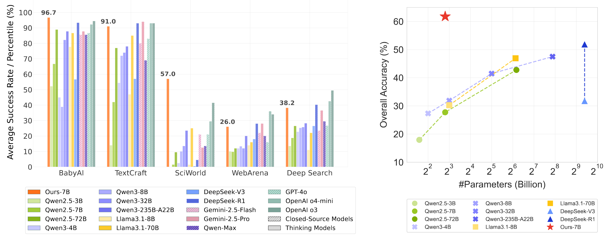
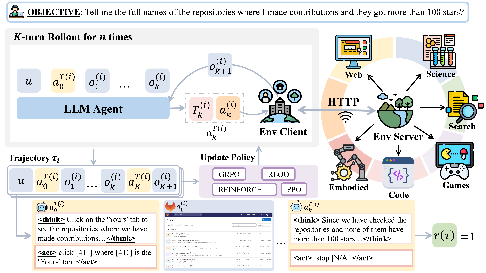
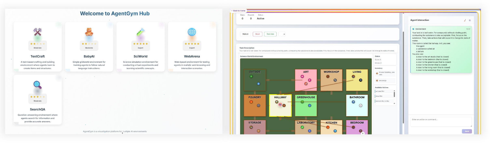
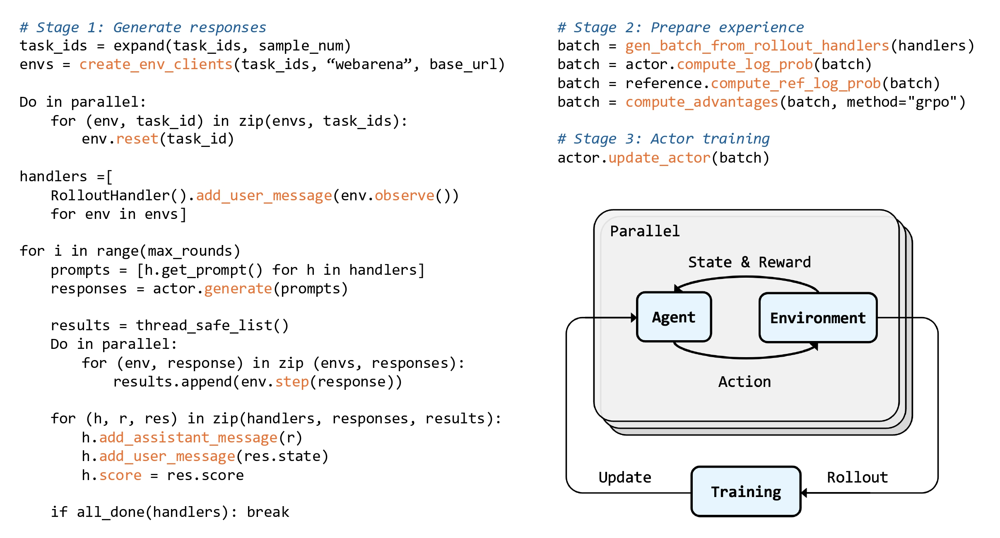
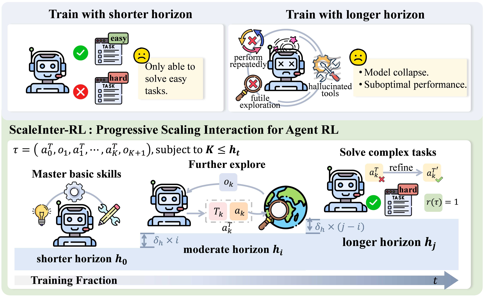
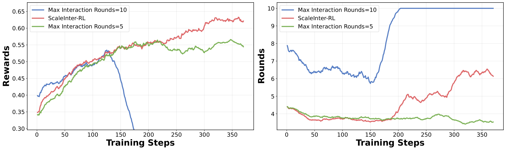

# AgentGym-RL: Training LLM Agents for Long-Horizon Decision Making through Multi-Turn Reinforcement Learning
<p align="center">
  📃 <a href="TODO" target="_blank">Paper</a > • 🌐 <a href="TODO" target="_blank">Project Page</a > • 🤗 <a href="https://huggingface.co/datasets/AgentGym/AgentGym-RL-Data-ID" target="_blank">AgentGym-RL-Data-ID</a >
</p >

AgentGym-RL is a new framework to train LLM agents for **multi-turn** interactive decision-making through RL. It encompasses a wide variety of **real-world scenarios** and supports mainstream RL algorithms. Extensive experiments show that our framework and method substatially enhances the open-sourced 7B-scale model to a level that **match or surpass commercial models** on **27 tasks** across diverse environments.



## 🔔 News

- **🎉[2025-09-10]** You can develop your custom environment to AgentGym. The tutorial is [here](https://github.com/WooooDyy/AgentGym/blob/main/docs/tutorials/en/05-2nd-Development.md).
- **🥳[2025-09-10]** Our paper is released on arXiv: [AgentGym-RL: Training LLM Agents for Long-Horizon Decision Making through Multi-Turn Reinforcement Learning](TODO)
- **🍺[2025-09-10]** Our RL dataset and benchmark are available on Hugging Face: [AgentGym-RL-Data-ID](https://huggingface.co/datasets/AgentGym/AgentGym-RL-Data-ID)

## 🌟 Overview

Developing autonomous LLM agents capable of making a series of intelligent decisioiins to solve complex, real-world tasks is a fast-evolving frontier. Merely relying on human demonstration for behaviour cloning can make agents competent for tasks, but rarely leads to genuine breakthoughs. As Richard Sutton emphasizes, it is the knowledge, skills and experience acquired through exploration and interaction with the environment that truly drives agents forward. Therefore, a promising approach is to train these agents using Reinforcement Learning.

Most existing studies remain limited to single-turn tasks like math and coding. Recent attempts to extend RL to train LLM agents with multi-turn capabilities face notable challenges:

- **Restricted task complexity and environment diversity.** In the era of reinforcement learining, environments have become increasingly crucial. Agents that perform well only in toy settings struggle to transfer to real-world scenarios, while diversity in environments is a prerequisite for their generalization. 
- **Difficulties in achieving stable and efficient** **optimization**. Multi-turn interaction dramatically enlarges the search space and increases variance in training signals, making it challenging to strike a balance between exploration and exploitation. 

To address these challenges, we introduce **AgentGym-RL**, a new framework to train LLM agents for **multi-turn** interactive decision-making through RL. It encompasses a wide variety of **real-world scenarios** and supports mainstream RL algorithms, establishing a foundation for the research and practice **in the era of experience**.



Furthermore, to tackle the exploration–exploitation trade-off and improve optimization stability in agent RL training, we propose **ScalingInter-RL**, a method that progressively extends the agent–environment interaction horizon during training. Experiments across different environments show that leveraging our AgentGym-RL framework with the ScalingInter-RL algorithm yields stable, sustained and substantial behavioral improvement.

In addition, to facilitate probing of data and model behaviors, we provide an **visualized interactive** **user interface** that allows for the replay and examination of full interaction trajectories, thereby streamlining empirical analysis for iterative development.



## 📖 Table of Contents

- [AgentGym-RL: Training LLM Agents for Long-Horizon Decision Making through Multi-Turn Reinforcement Learning](#agentgym-rl-training-llm-agents-for-long-horizon-decision-making-through-multi-turn-reinforcement-learning)
  * [🔔 News](#-news)
  * [🌟 Overview](#-overview)
  * [Features](#features)
    + [Modular System Design of AgentGym-RL](#modular-system-design-of-agentgym-rl)
    + [Environments](#environments)
    + [Post-Training Strategies](#post-training-strategies)
    + [ScalingInter-RL: Progressive Scaling Interaction for Agent RL](#scalinginter-rl-progressive-scaling-interaction-for-agent-rl)
    + [Extending Verl](#extending-verl)
  * [Performance](#performance)
  * [Running Tutorial](#running-tutorial)
    + [Environment Setup](#environment-setup)
    + [Training](#training)
    + [Evaluation](#evaluation)
    + [Visualized user interface](#visualized-user-interface)
  * [Acknowledgement](#acknowledgement)
  * [Contact](#Contact)
  * [Citation](#citation)

## Features

### Modular System Design of AgentGym-RL

We adopt a modular and decoupled design to implement AgentGym-RL, organizing it into three main components:

- **Environment** **module**: provides diverse scenarios via a standardized server–client architecture with unified HTTP protocols and parallel requests.
- **Agent module**: encapsulates the reasoning and decision-making process of agents in multi-turn interactions, with support for advanced mechanisms such as long-horizon planning and self-reflection. 
- **Training module**: implements reinforcement learning pipelines and other training methods to optimize agent policies. 



### Environments

* **Web Navigation**: We include **WebArena**, a realistic and reproducible web environment containing 4 distinct domains prevalent on the internet: online shopping, discussioin forums, collaborative development, and bussiness contnt management.
* **Deep Search**: Building upon **Search-R1**, we include a RAG-based environment which enables LLMs to interact with search engines and solve multi-turn retrieval and reasoning tasks.
* **Digital Games**: We include **TextCraft**, a text-based crafting game environment in which agents complete tasks via natural language interactions and task-based planning.
* **Embodied Tasks**: We include **BabyAI** which provides a controllable grid world with text instructions for embodied reasoning in simulated environments.
* **Scientific Tasks**: We include **SciWorld** which offers a scientific exploration simulator where agents conduct scientific experimemts through text-driven reasoning cycles. 

### Post-Training Strategies

AgentGym-RL supports a suite of mainstream online RL algorithms: **PPO, GRPO, RLOO, REINFORCE++.**

Beyond online RL, AgentGym-RL also supports a broad range of complementary training paradigms: **SFT, DPO, AgentEvol.**

### ScalingInter-RL: Progressive Scaling Interaction for Agent RL

ScalingInter-RL is a training approach designed to balance exploration and exploitation while ensuring stable optimization. At its core is a **progressive horizon-scaling strategy** that adaptively adjusts the number of interaction turns during RL.



We start training with a smaller horizon, allowing the agent to efficiently exploits its policy and gain early proficiency on simple tasks. This establishes  the groundwork for deeper, long-horizon reasoning.  As training progresses, we gradually extend the horizon, enabling the agent to explore longer decision paths and fostering the emergence of higher-order cognitive behaviors.

### Extending Verl

We make following modifications to verl in order to develop AgentGym-RL:

1. **Rollout using vllm engine**: To support multi-turn rollouts and efficent interaction with the environment, we introduce:

   * RolloutHandler to handle trajectories. We introduce `RolloutHandler` to correctly compute the attention masks, loss masks, position ids and sequence ids for environment observations and assistant's actions in each turn. It also handles historical messages, status and reward.

   * EnvClient to handle interactions. The `EnvClient` provides several methods to facilitates interactions with the environment during rollout, such as observarion() to get the currect observation from the environment, available_actions() to get the currectly available actions, step() to perform an action, and reset() to reset the environmet. To improve efficiency, our framework initializes environments and collects trajectories in parallel.

2. **Advantage computation**: We revise verl's implementation of advantage computation for REINFORCE++ and GAE to ensure correctness in both single-turn and multi-turn scenarios.

3. **Scaling interaction during training**: To develop ScalingInter-RL, we introduce `RoundScheduler` to scale interactions during training. The `FixedRoundsScheduler` enforces a fixed maximum number of interactions. The `StepRoundsScheduler` gradually increases the interaction horizon in a step-wise manner, enabling progressive scaling during training.

## Performance

We leverage Qwen2.5-3B and Qwen2.5-7B as our primary backbone models. We evaludate AgentGym-RL and ScalingInter-RL across **five scenarios** and include multiple closed-source models and open-source models for comparison. The evaluation results on WebArena benchmark are as follows, while results on other benchmarks can be found in our [paper](TODO).


- The **ScalingInter-7B** model significantly **surpasses top-tier proprietary models** like GPT-4o, and **performs on par with larger models** like DeepSeek-R1-0528 and Gemini-2.5-Pro. Moreover, in Shopping and CMS, the achieved score matches the best performance among all models in these categories.
- The **AgentGym-RL-7B** achieved an overall score that **matches the performance of GPT-4o**.

Moreover, ScalingInter-RL demonstrates more **stable and effcient** training dynamics during RL optimization as shown in the figure below. 



* Longer-turn settings initially achieve higher rewards by enabling richer exploration but rapidly collapse; Shorter-turns yield more stable but less exploratory learning, leading to a performance ceilling. 
* Our ScalingInter-RL method **progressively increases the interaction horizon**, and ultimately achieves **higher and more efficient** long-term performance.

## Running Tutorial

### Environment Setup

We recommend using CUDA 12.4, PyTorch 2.4, and Python 3.10. First, install the requirements using the following command:
```sh
echo "Preparing environment for agentgym-rl..."
conda create -n agentgym-rl python==3.10 -y
conda activate agentgym-rl
pip3 install torch==2.4.0 --index-url https://download.pytorch.org/whl/cu124
# install flash-atten
FLASH_ATTENTION_URL="https://github.com/Dao-AILab/flash-attention/releases/download/v2.7.3/flash_attn-2.7.3+cu12torch2.4cxx11abiFALSE-cp310-cp310-linux_x86_64.whl"
FLASH_ATTENTION_NAME="flash_attn-2.7.3+cu12torch2.4cxx11abiFALSE-cp310-cp310-linux_x86_64.whl"
wget -q $FLASH_ATTENTION_URL -O $FLASH_ATTENTION_NAME
pip3 install $FLASH_ATTENTION_NAME
rm -f $FLASH_ATTENTION_NAME
# for RL
cd AgentGym-RL
pip3 install -e .
# for agentgym
echo "Preparing environment for agentenv..."
cd AgentGym/agentenv
pip3 install -e .
pip3 install transformers==4.51.3
```

### Training

For SFT, DPO and AgentEvol, please refer to the `README.md` of [AgentGym](https://github.com/WooooDyy/AgentGym/tree/640f8bca6901a6a6d540ff61522b813988da47c4/).

For RL training:

**1. Environment Setup**

Make sure you have the required environments set up (see [Environment Setup section](#environment-setup) above).

**2. Data Preparation**

Download the AgentGym-RL-Data-ID dataset from [Huggingface](https://huggingface.co/datasets/AgentGym/AgentGym-RL-Data-ID).

**3. Launch the environment server**

Please launch the environment server by referring to the `README.md` of [AgentGym](https://github.com/WooooDyy/AgentGym/tree/640f8bca6901a6a6d540ff61522b813988da47c4).

**4. Training**

You can see the training example scripts for each task in the [examples/train](./examples/train) for AgentGym-RL and the ScalingInter-RL. In addition, you may refer to the training parameters configured in those scripts.

```sh
bash webarena_train.sh
```

Most explanations of the arguments can be found in the docs of [verl](https://verl.readthedocs.io/en/latest/examples/config.html). Other key arguments:
* `data.max_prompt_length`: Maximum length of the general task description prompt in the first turn.
* `data.max_response_length`: Maximum total token length of the interaction trajectory (excluding the task prompt).
* `actor_rollout_ref.agentgym.task_name`: Training task name of AgentGym.
* `actor_rollout_ref.agentgym.env_addr`: URL of the AgentGym environment server.
* `actor_rollout_ref.rollout.max_tokens`: Maximum token length of a single response per turn.
* `actor_rollout_ref.rollout.rollout_log_dir`: Directory for storing rollout trajectories.
* `algorithm.rounds_ctrl.type`: Strategy for controlling the maximum number of interaction turns. Options:
  - `fixed`: fixed number of turns.
  - `scaling_inter_stepwise`: number of turns increases at fixed step intervals.
* `algorithm.rounds_ctrl.rounds`: Maximum number of allowed interaction turns.
* `algorithm.rounds_ctrl.steps_scaling_inter`: Frequency (in training steps) to increase the maximum number of turns when using `scaling_inter_stepwise`.

See [AgentGym-RL/verl/agent_trainer/config/ppo_trainer.yaml](./AgentGym-RL/verl/agent_trainer/config/ppo_trainer.yaml) for more details.

To launch the AgentGym-RL training, set:

```sh
algorithm.rounds_ctrl.type=fixed \
algorithm.rounds_ctrl.rounds=15 \
```

You can see [examples/train/AgentGym-RL/webarena_train.sh](./examples/train/AgentGym-RL/webarena_train.sh) as an example.

To launch the ScalingInter-RL training, set:

```sh
algorithm.rounds_ctrl.type=scaling_inter_stepwise\
algorithm.rounds_ctrl.steps_scaling_inter=100 \
algorithm.rounds_ctrl.rounds=[10,20,30] \
```

You can see [examples/train/ScalingInter-RL/webarena_train.sh](./examples/train/ScalingInter-RL/webarena_train.sh) as an example.

### Evaluation

**1. Environment Setup**

Make sure you have the required environments set up (see [Environment Setup section](#environment-setup) above).

**2. Data Preparation**

Download the AgentGym-RL-Data-ID dataset from [Huggingface](https://huggingface.co/datasets/AgentGym/AgentGym-RL-Data-ID).

**3. Launch the environment server**

Please launch the environment server by referring to the `README.md` of [AgentGym](https://github.com/WooooDyy/AgentGym/tree/640f8bca6901a6a6d540ff61522b813988da47c4).

**4. Evaluation**

You can see the evaluation example scripts for each task in the `examples/eval`. In addition, you may refer to the evaluation parameters configured in those scripts.

To run the evaluation, you can see `examples/eval/webarena_eval.sh` as an example.

```sh
bash webarena_eval.sh
```

Most explanations of the arguments can be found in the docs of [verl](https://verl.readthedocs.io/en/latest/examples/config.html). See `AgentGym-RL/verl/agent_trainer/config/generation.yaml` for more details.

### Visualized user interface

Check [here](https://github.com/WooooDyy/AgentGym/tree/640f8bca6901a6a6d540ff61522b813988da47c4/env-visualization) for setup instructions.

## Acknowledgement

The Training module of AgentGym-RL is built upon [Verl](https://github.com/volcengine/verl), and the Environment module is built upon [AgentGym](https://github.com/WooooDyy/AgentGym). We are grateful for their infrastructure support.  We also extend our thanks to [TextCraft](https://github.com/archiki/ADaPT), [BabyAI](https://github.com/mila-iqia/babyai), [SciWorld](https://github.com/allenai/ScienceWorld), [WebArena](https://github.com/web-arena-x/webarena), [Search-R1](https://github.com/nyu-dl/dl4ir-searchQA) for their opensource.

## Contact

- zhxi22@m.fudan.edu.cn

## Citation

Please cite the following paper if you find AgentGym-RL helpful!

```
TODO
```

<div align="center">

</div>
